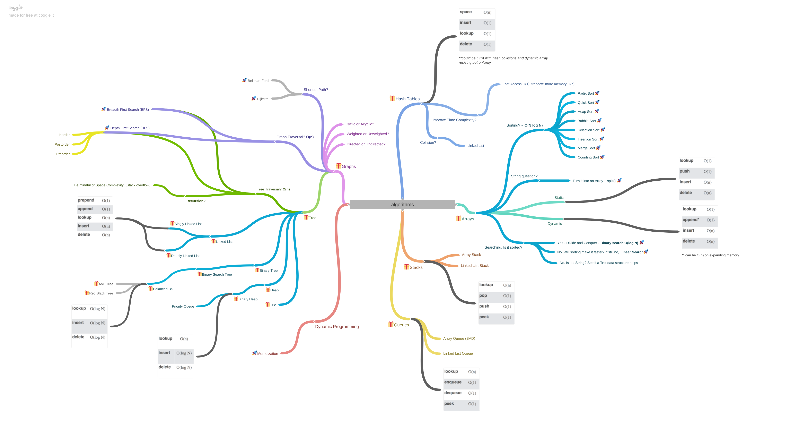

# Estrutura de Dados e Algoritmos

Este repositório contém algoritmos e estruturas de dados populares.

Cada algoritmo e estrutura de dado possui seu próprio README
com explicações relacionadas e links para leitura adicional

## Estruturas de dados

Uma estrutura de dados é uma maneira particular de organizar e armazenar dados em um computador para que ele possa
ser acessado e modificado de forma eficiente. Mais precisamente, uma estrutura de dados é uma coleção de dados
valores, as relações entre eles e as funções ou operações que podem ser aplicadas aos dados.

* [Arrays](src/data-structures/array)
* [Hash Table](src/data-structures/hashtables)
* [Linked List](src/data-structures/lists/linked-list/singly)
* [Doubly Linked List](src/data-structures/lists/linked-list/doubly)
* [Stacks & Queue](src/data-structures/stacks-queue)
* [Trees](src/data-structures/trees)

## Algoritmos

Um algoritmo é uma especificação inequívoca de como resolver uma classe de problemas. Isto é
um conjunto de regras que define precisamente uma sequência de operações.

### Algoritmos por Tópico
* **Architecture**
  * [Exponential Backoff and jitter](src/architecture/exponential-backoff-and-jitter)
* **Inteligência Artificil e Machine Learning**
  * [Sistemas de recomendação](src/ml-ia/ml/recommender)
  * [Rede Neural - Perceptron de uma camada](src/ml-ia/ia/neural-network/single-layer)
  * Algoritmos de Otimização
    * [Algoritmos genéticos](src/ml-ia/ia/genetic-algorithms)

* **Buscas**
  * [Binary Search](src/algorithms/search/binary-search)

* **Ordenação**
  * [Bubble Sort](src/algorithms/sorting/bubble-sort)
  * [Selection Sort](src/algorithms/sorting/selection-sort)
  * [Insertion Sort](src/algorithms/sorting/insertion-sort)
  * [Shell Sort](src/algorithms/sorting/shell-sort)
  * [Merge Sort](src/algorithms/sorting/merge-sort)
  * [Quicksort](src/algorithms/sorting/quick-sort)

* **Problemas**
  * [Median of Two Sorted Arrays](src/problems/median-of-two-sorted-arrays)
  * [Reverse Integer](src/problems/reverse-integer)
  * [Palindrome Number](src/problems/palindrome-number)
  * [Soma Recursiva](src/problems/recursive-sum)
  * [Gene Compression](src/problems/gene-compression)
  * [Leibniz π](src/problems/calculating-pi)
  * [One time pad](src/problems/one-time-pad)
  * [Roman to Integer](src/problems/roman-to-integer)
  * [Sort Colors](src/problems/sort-colors)
  * [Sort Characters By Frequency](src/problems/sort-characters-by-frequency)
  * [Reverse Words In a String](src/problems/reverse-words-in-a-string)
  * [Min Stack](src/problems/min-stack)
  * [Transpose Matrix](src/problems/transpose-matrix)
  * [First Recurring Character](src/problems/first-recurring-character)
  * [Two Sum](src/problems/two-sum)
  * [Best Time to Buy and Sell Stock II](src/problems/best-time-to-buy-sell-stock)
  * [Combination Sum IV](src/problems/combination-sum-iv)
  * [Fibonacci](src/problems/fibonacci/solution.go)
  * [Contains Duplicate](src/problems/contains-duplicate)
  * [Move Zeroes](src/problems/move-zeroes)
  * [Rotate Array](src/problems/rotate-array)

## Técnicas usadas

### Recursão
A recursão, em particular, está no coração não só de vários algoritmos, mas até mesmo em linguagens de programação completas.

Em algumas linguagens de programação funcional, como Scheme e Haskell, a recursão substitui os laços usados nas linguagens imperativas. Contudo, vale a pena lembrar que tudo que pode ser feito com uma técnica recursiva também pode sê-lo com uma técnica iterativa.

### Memoization
A memoization tem sido aplicada com sucesso para agilizar o trabalho dos parsers (programas que interpretam linguagens). É útil para todos os problemas nos quais o resultado de um cálculo recente será provavelmente solicitado de novo.

Outra aplicação da memoization está nos runtimes de linguagens. Alguns runtimes de linguagens (versões de Prolog, por exemplo) armazenam os resultados das chamadas de funções automaticamente (automemoization), de modo que a função não precisará executar da próxima vez que a mesma chamada for feita.

### Compactação
A compactação tem feito com que um mundo conectado pela internet com limitações de largura de banda seja mais tolerável.

A técnica de cadeia de bits pode ser usada para tipos de dados simples do mundo real que tenham um número limitado de valores possíveis, para os quais mesmo um byte poderia ser um exagero.

A maioria dos algoritmos de compactação, porém, atua encontrando padrões ou estruturas em um conjunto de dados, os quais permitem que informações repetidas sejam eliminadas.

## Big O

* Usado para realizar a comparação objetiva entre algorítimos
* O quanto a "complexidade"do algoritmo aumenta de acordo com as entradas

Ordem de crescimento dos algoritmos especificados em notação Big O

Fonte: [Notação Big-O dicas](http://bigocheatsheet.com/).

### Notações Big O mais usadas e comparação de desempenho em relação aos diferentes tamanhos dos dados de entrada.

| Notação Big-O         | Nome         | Calc. 10 itens | Calc. 100 itens | Calc. 1000 itens |
| --------------------- | ------------ | -------------- | --------------- | -----------------|
| **O(1)**              | Constant     | 1              | 1               | 1                |
| **O(log n)**          | Logarithmic  | 3              | 6               | 9                |
| **O(n)**              | Linear       | 10             | 100             | 1000             |
| **O(n * log(n))**     | Linearithmic | 30             | 600             | 9000             |
| **O(n2)**  | Quadratic    | 100            | 10000           | 1000000          |
| **O(2n)**  | Exponential  | 1024           | 1.26e+29        | 1.07e+301        |
| **O(n!)**             | Factorial    | 3628800        | 9.3e+157        | 4.02e+2567       |

### Complexidade de operações em estrutura de dados

| estrutura de dados      | Acesso    | Busca     | Inserção  | Deleção   |
| ----------------------- | --------- | --------- | --------- | --------- |
| **Array**               | O(1)      | O(n)      | O(n)      | O(n)      |
| **Stack**               | O(n)      | O(n)      | O(1)      | O(1)      |
| **Queue**               | O(n)      | O(n)      | O(1)      | O(1)      |
| **Linked List**         | O(n)      | O(n)      | O(1)      | O(1)      |
| **Hash Table**          | -         | O(n)      | O(n)      | O(n)      |
| **Binary Search Tree**  | O(n)      | O(n)      | O(n)      | O(n)      |
| **B-Tree**              | O(log(n)) | O(log(n)) | O(log(n)) | O(log(n)) |
| **Red-Black Tree**      | O(log(n)) | O(log(n)) | O(log(n)) | O(log(n)) |
| **AVL Tree**            | O(log(n)) | O(log(n)) | O(log(n)) | O(log(n)) |
| **Bloom Filter**        | -         | O(1)      | O(1)      | -         |

### Complexidade dos algoritmos para Ordenação de Array

| Nome                  | Melhor Cenário   | Cenário OK                      | Pior Cenário              | Mémoria   | Estável |
| --------------------- | ---------------- | ------------------------------- | ------------------------  | --------- | ------- |
| **Bubble sort**       | O(n)             | O(n2)                | O(n2)          | 1         | Sim     |
| **Insertion sort**    | O(n)             | O(n2)                | O(n2)          | 1         | Sim     |
| **Selection sort**    | O(n2) | O(n2)                | O(n2)          | 1         | Não     |
| **Heap sort**         | O(n log(n))      | O(n log(n))                     | O(n log(n))               | 1         | Não     |
| **Merge sort**        | O(n log(n))      | O(n log(n))                     | O(n log(n))               | n         | Sim     |
| **Quick sort**        | O(n log(n))      | O(n log(n))                     | O(n2)          | log(n)    | Não     |
| **Shell sort**        | O(n log(n))      | depende da sequência de lacunas | O(n (log(n))2) | 1         | Não     |
| **Counting sort**     | O(n + r)         | O(n + r)                        | O(n + r)                  | n + r     | Sim     |
| **Radix sort**        | O(n * k)         | O(n * k)                        | O(n * k)                  | n + k     | Sim     |

## Números de latência

## Técnicas para resolução de problemas
- Quando você receber o problema, anote os pontos chave do problema. Certifique-se de ter todos os detalhes.
- Certifique-se de verificar duas vezes: Quais são as entradas? Quais são as saídas?
- Qual é o valor mais importante do problema? Você tem tempo, espaço e memória, etc. Qual é o objetivo principal?
- Comece com a abordagem ingênua/bruta. Primeira coisa que vem à mente. Isso mostra que você é capaz de pensar bem e criticamente (você não precisa escrever este código, apenas fale sobre ele).
- Diga por que essa abordagem não é a melhor (ou seja, O(n^2) ou mais, não legível, etc...)
- Comece realmente a escrever seu código agora. Lembre-se de que quanto mais você se preparar e entender o que precisa codificar, melhor será a entrevista na lousa. Então, nunca comece uma entrevista na lousa sem ter certeza de como as coisas vão funcionar. Isso é uma receita para o desastre.
- Teste seu código: verifique sem parâmetros, 0, indefinido, nulo, matrizes enormes, código assíncrono, etc.

## Checklist de um bom código:
- [✅] Bom uso de estruturas de dados
- [✅] Reutilização de código / Não repita a si mesmo
- [✅] Modular - torna o código mais legível, mantível e testável
- [✅] Menos que O(N^2). Queremos evitar loops aninhados se pudermos, pois eles são ruins. Dois loops separados são melhores do que 2 loops aninhados
- [✅] Baixa Complexidade de Espaço --> A recursão pode causar estouro de pilha, a cópia de arrays grandes pode exceder a memória da máquina.

## Heurísticas para resolver problemas de codificação:
- [✅] Hash Maps geralmente são a resposta para melhorar a Complexidade de Tempo
- [✅] Se for um array ordenado, use uma árvore binária para alcançar O(log N). Dividir e Conquistar - Divida um conjunto de dados em pedaços menores e repita um processo com um subconjunto de dados. A pesquisa binária é um ótimo exemplo disso
- [✅] Tente ordenar a entrada dos dados
- [✅] Hash tables e informações pré-computadas (ou seja, ordenadas) são algumas das melhores maneiras de otimizar seu código
- [✅] Pense sobre Complexidade de Tempo vs Complexidade de Espaço. Às vezes, armazenar um estado extra na memória pode ajudar no tempo.
- [✅] Space time tradeoffs: Hash tables geralmente resolvem isso na maioria das vezes. Você usa mais espaço, mas pode obter uma otimização de tempo para o processo.

## Algorithms

### Referências

- [System design primer](https://github.com/donnemartin/system-design-primer)
- [Estruturas de dados e algoritmos no YouTube](https://www.youtube.com/playlist?list=PLLXdhg_r2hKA7DPDsunoDZ-Z769jWn4R8)
- [Estrutura de Dados e Algoritmos em JavaScript](https://github.com/trekhleb/javascript-algorithms/blob/master/README.md)
- [Latency numbers every programmer should know](https://gist.github.com/hellerbarde/2843375)
