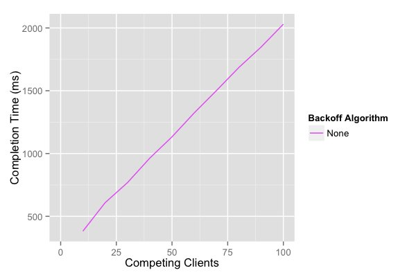
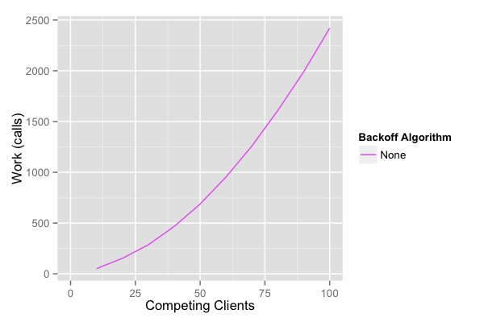
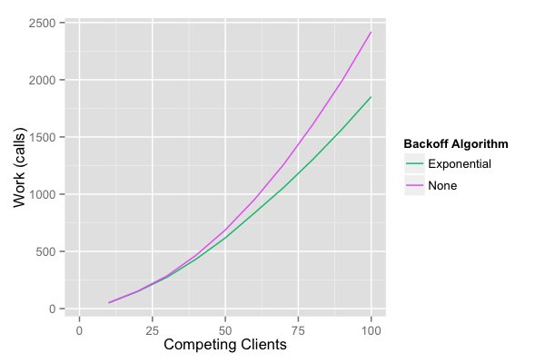
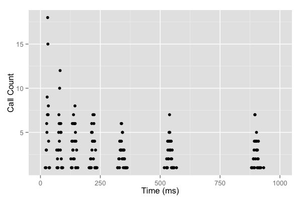
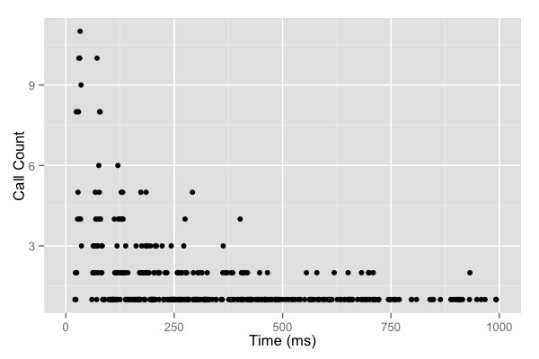
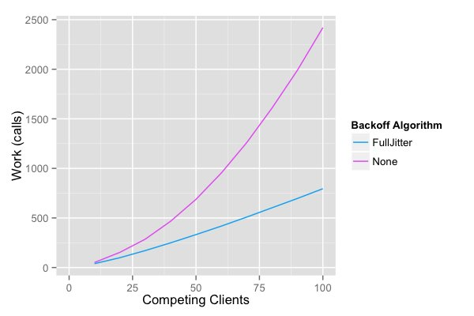
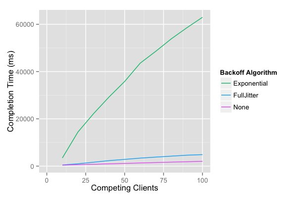
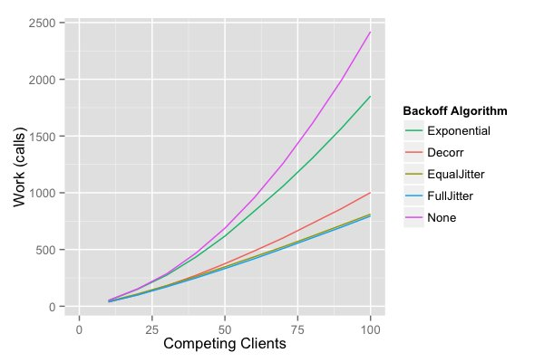
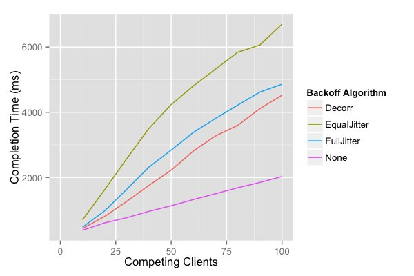

# Exponential Backoff And Jitter
Optimistic concurrency control (OCC) is a time-honored way for multiple writers to safely modify a single object without losing writes. OCC has three nice properties: it will always make progress as long as the underlying store is available, it’s easy to understand, and it’s easy to implement. DynamoDB’s conditional writes make OCC a natural fit for DynamoDB users, and it’s natively supported by the DynamoDBMapper client.

While OCC is guaranteed to make progress, it can still perform quite poorly under high contention. The simplest of these contention cases is when a whole lot of clients start at the same time, and try to update the same database row. With one client guaranteed to succeed every round, the time to complete all the updates grows linearly with contention.

For the graphs in this post, I used a small simulator to model the behavior of OCC on a network with delay (and variance in delay), against a remote database. In this simulation, the network introduces delay with a mean of 10ms and variance of 4ms. The first simulation shows how completion time grows linearly with contention. This linear growth is because one client succeeds every round, so it takes N rounds for all N clients to succeed.



Unfortunately, that’s not the whole picture. With N clients contending, the total amount of work done by the system increases with N2.




## Adding Backoff
The problem here is that N clients compete in the first round, N-1 in the second round, and so on. Having every client compete in every round is wasteful. Slowing clients down may help, and the classic way to slow clients down is capped exponential backoff. Capped exponential backoff means that clients multiply their backoff by a constant after each attempt, up to some maximum value. In our case, after each unsuccessful attempt, clients sleep for:

```
sleep = min(cap, base * 2 ** attempt)
```

Running the simulation again shows that backoff helps a small amount, but doesn’t solve the problem. Client work has only been reduced slightly.



The best way to see the problem is to look at the times these exponentially backed-off calls happen.



It’s obvious that the exponential backoff is working, in that the calls are happening less and less frequently. The problem also stands out: there are still clusters of calls. Instead of reducing the number of clients competing in every round, we’ve just introduced times when no client is competing. Contention hasn’t been reduced much, although the natural variance in network delay has introduced some spreading.

## Adding Jitter
The solution isn’t to remove backoff. It’s to add jitter. Initially, jitter may appear to be a counter-intuitive idea: trying to improve the performance of a system by adding randomness. The time series above makes a great case for jitter – we want to spread out the spikes to an approximately constant rate. Adding jitter is a small change to the sleep function:

```
sleep = random_between(0, min(cap, base * 2 ** attempt))
```



That time series looks a whole lot better. The gaps are gone, and beyond the initial spike, there’s an approximately constant rate of calls. It’s also had a great effect on the total number of calls.



In the case with 100 contending clients, we’ve reduced our call count by more than half. We’ve also significantly improved the time to completion, when compared to un-jittered exponential backoff.



There are a few ways to implement these timed backoff loops. Let’s call the algorithm above “Full Jitter”, and consider two alternatives. The first alternative is “Equal Jitter”, where we always keep some of the backoff and jitter by a smaller amount:

```
temp = min(cap, base * 2 ** attempt)
sleep = temp / 2 + random_between(0, temp / 2)
```

The intuition behind this one is that it prevents very short sleeps, always keeping some of the slow down from the backoff. A second alternative is “Decorrelated Jitter”, which is similar to “Full Jitter”, but we also increase the maximum jitter based on the last random value.

```
sleep = min(cap, random_between(0, sleep * 3))
```

## Which approach do you think is best?

Looking at the amount of client work, the number of calls is approximately the same for “Full” and “Equal” jitter, and higher for “Decorrelated”. Both cut down work substantially relative to both the no-jitter approaches.



The no-jitter exponential backoff approach is the clear loser. It not only takes more work, but also takes more time than the jittered approaches. In fact, it takes so much more time we have to leave it off the graph to get a good comparison of the other methods.



Of the jittered approaches, “Equal Jitter” is the loser. It does slightly more work than “Full Jitter”, and takes much longer. The decision between “Decorrelated Jitter” and “Full Jitter” is less clear. The “Full Jitter” approach uses less work, but slightly more time. Both approaches, though, present a substantial decrease in client work and server load.

It’s worth noting that none of these approaches fundamentally change the N2 nature of the work to be done, but do substantially reduce work at reasonable levels of contention. The return on implementation complexity of using jittered backoff is huge, and it should be considered a standard approach for remote clients.

All of the graphs and numbers from this post were generated using a simple simulation of OCC behavior. You can get our simulator code on GitHub, in the aws-arch-backoff-simulator project.