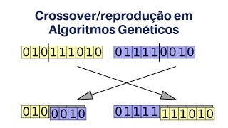

# Algoritmos genéticos

**Definição da Wikipedia** - Um algoritmo genético (AG) é uma técnica de busca utilizada na ciência da computação para achar soluções aproximadas em problemas de otimização e busca, fundamentado principalmente pelo americano John Henry Holland. Algoritmos genéticos são uma classe particular de algoritmos evolutivos que usam técnicas inspiradas pela biologia evolutiva como hereditariedade, mutação, seleção natural e recombinação (ou crossing over).

Algoritmos Genéticos (AG) são implementados como uma simulação de computador em que uma população de representações abstratas de solução é selecionada em busca de soluções melhores. A evolução geralmente se inicia a partir de um conjunto de soluções criado aleatoriamente e é realizada por meio de gerações. A cada geração, a adaptação de cada solução na população é avaliada, alguns indivíduos são selecionados para a próxima geração, e recombinados ou mutados para formar uma nova população. A nova população então é utilizada como entrada para a próxima iteração do algoritmo.

## Ciclo do algoritmo genético

>> Fonte https://slideplayer.com.br/slide/1765279/ [Prof Celso Camilo]

## Detalhamento do Crossover

>> Fonte https://www.youtube.com/watch?v=ZU0CQXDqfVc [IA Expert Academy]

## Referência
- [Wikipedia](https://en.wikipedia.org/wiki/Genetic_algorithm)
- [IA Expert Academy](https://iaexpert.academy/)